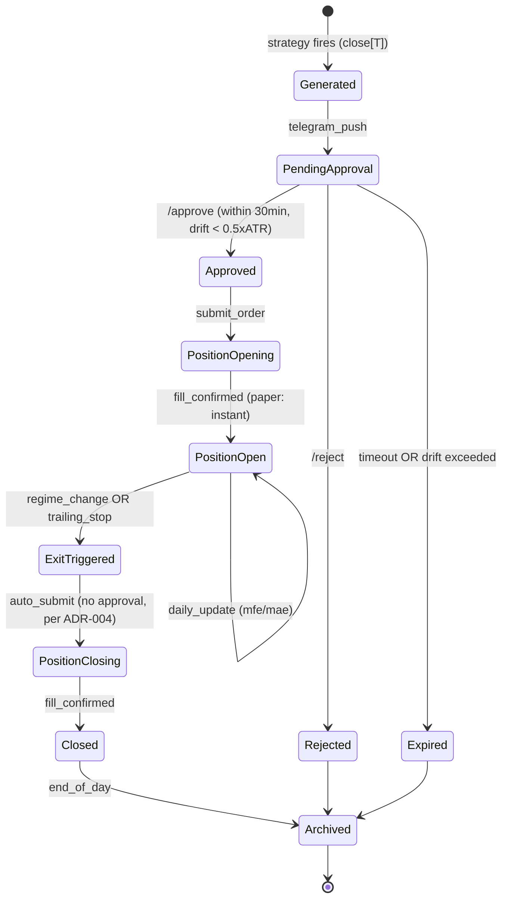

# Helios Architecture

> Last updated: 2026-05-17 (v0.1.14.1.4)
> Co-developed by Trade Agent + Claude
> Reviewer-blessed structure (see RESEARCH_JOURNAL.md for review history)

---

## §0  Identity

**Helios IS:**
- **Regime-filtered** — trades only when market structure permits
- **Trend-following** — captures persistence, not reversals or fair value
- **Portfolio-constrained** — disciplined capital allocation with sector / ETF caps
- **Medium-frequency** — 1-3 month holding period, daily-batch cadence
- **Taiwan-specific** — TWSE universe, 台股 cost model, Taiwan corporate-action semantics
- **Systematic** — deterministic rules end-to-end, no discretion at signal level
- **Human-supervised** — Telegram approval required for every entry; no autopilot

**Helios IS NOT:**
- An AI / LLM stock predictor
- A high-frequency / intraday system
- A multi-strategy alpha factory
- A research notebook
- A general-purpose trading framework
- A signal generator for someone else's execution
- A black box (every signal has reasons + audit trail)

> **Identity is the system's complexity firewall.** Every future feature must pass:
> "Does this serve a Regime-filtered + Trend-following + Portfolio-constrained + Medium-frequency + Taiwan-specific + Systematic + Human-supervised trading engine?"
> If no, it does not belong in Helios — fork it into another project.

---

## §0.5  Simplicity Doctrine (Standing Order)

> If §0 Identity defines **what Helios is**, this section defines **how we add things**.

**Complexity must justify itself.** Every proposed addition — new dependency, runtime, abstraction, model, infrastructure component, data source, dashboard, framework — must demonstrably pass three tests:

1. **Measurable alpha contribution** — concrete evidence the change improves a defined metric (PF, max DD, hit rate, operational reliability). Not "it might help" or "industry best practice".
2. **Operational necessity** — solves a real problem we have today, not a hypothetical future scenario.
3. **Maintenance sustainability** — the long-term cost (debugging, version updates, dependency hell, mental load) is bearable for a single-operator system.

If any test cannot be argued cleanly, the addition is **rejected**.

This doctrine applies recursively — even improvements to existing layers (e.g., "add a second indicator", "expand the universe", "add Telegram rich-format") must pass.

**Why this matters**: trading systems rarely die from strategy failure. They die from accumulated complexity that erodes operational capacity faster than alpha grows. The Simplicity Doctrine is Helios's primary defense against that failure mode — which is statistically the most common cause of quantitative system death.

ADRs in `decision_records/` are specific applications of this doctrine (ADR-001 rejected HFT infra; ADR-002 rejected TA-Lib; ADR-005 rejected ML regime; ADR-006 rejected premature abstraction). When proposing changes, first check whether an existing ADR already settles the question. If not, write a new ADR that argues the three tests above.

---

## §0.7  Determinism Principle

Every decision in Helios — regime classification, signal generation, exit triggering, portfolio constraint application — is **deterministic**: same inputs always produce same outputs.

Rationale:

- **Every signal must be auditable** — when something looks wrong, the cause is reachable in a finite number of code lines, not buried in fitted model weights
- **Operator trust > theoretical predictive power** — a system the operator can mentally simulate beats a fitted model the operator cannot reason about; trust earned through transparent determinism is the foundation on which paper-trading scars (and eventually live-trading capital) compound
- **Reproducibility > micro-optimization** — identical regime label / signal / exit across runs / versions / machines is more valuable than a 0.5% PF improvement from an ML classifier that drifts
- **Regime systems benefit from consistency more than adaptivity** — switching regime models mid-run is the failure mode, not the feature

Determinism is enforced at every boundary: no random seeds (because nothing is randomized), no model state files (because there are no fitted models in v0.1), no API-dependent classifications (because everything is computed from local DuckDB).

See ADR-005 for the full reasoning behind deterministic regime over HMM/ML.

---

## §1  Mission

A personal-grade institutional Taiwan equity trend system for medium-term holdings.

Capital scale: NTD 300k–1M (single account). Universe: 15 symbols (5 ETFs + 10 large-cap stocks). Operator: single user, manual approval workflow.

The goal is **steady risk-adjusted returns through disciplined trend capture in healthy markets and disciplined non-participation in unhealthy ones** — not maximum CAGR.

---

## §2  Why Helios is intentionally NOT HFT

> Every line below is a deliberate architecture decision. Each closes off a complexity vector.

| Property | Helios Choice | Closed-off complexity |
|---|---|---|
| Cadence | Daily batch (one cron per day) | No event loop, no websocket, no message queue |
| Latency | ~26-day average holding → seconds don't matter | No co-location, no sub-millisecond execution |
| Fill model | Close-based (T+0 close, paper trade T+1 open) | No tick data, no order-book reconstruction |
| Indicator math | Polars expressions in batch | No streaming-window state, no incremental computation |
| Regime classification | Daily snapshot of TAIEX | No real-time regime tracking, no HMM particle filter |
| Approval | Telegram, human in loop | No autopilot risk model, no kill-switch ladder |
| Decision speed | "End of trading day → review → next morning fill" | No microstructure modeling, no spread-capture logic |
| Position size | 20% of equity per name | No Kelly, no covariance optimization, no allocation solver |

**Alpha hypothesis explicitly does not depend on:**
- Microsecond execution precision
- Intraday momentum bursts
- Microstructure features (spread, depth, imbalance)
- News sentiment / NLP signals
- Real-time alternative data

**Alpha hypothesis explicitly does depend on:**
- Trend persistence over multi-week horizons
- Regime stability (bull regimes lasting weeks/months, not minutes)
- Volume confirmation at breakout (daily volume aggregate, not tick prints)
- ATR-scaled risk management (daily volatility)

**Therefore the entire HFT toolchain is dead weight for this system** — and worse, it would slowly erode operational simplicity, the actual moat.

---

## §3  Layer Map

```
┌──────────────────────────────────────────────────────────────────┐
│  Execution Layer (v0.1.14.2)             [next]                  │
│  • execution/paper_broker.py                                     │
│  • communication/telegram/                                       │
│  • scripts/daily_run.py                                          │
│  Explicit non-goals: no websocket, no async, no streaming        │
└──────────────────────────────────────────────────────────────────┘
                                ▲
┌──────────────────────────────────────────────────────────────────┐
│  Portfolio Layer (v0.1.14.1)             [done]                  │
│  • portfolio/risk_budget.py     Capital constraints              │
│  • portfolio/selector.py        Sector classification            │
│  • backtest/portfolio_simulator Capital-aware lifecycle          │
│  • scripts/run_portfolio_backtest.py  CLI                        │
└──────────────────────────────────────────────────────────────────┘
                                ▲
┌──────────────────────────────────────────────────────────────────┐
│  Strategy + Backtest Layer (v0.1.12-13)  [done]                  │
│  • strategies/{base,trend_breakout}.py                           │
│  • strategies/exit/{regime_exit,trailing_stop}.py                │
│  • backtest/round_trip.py                                        │
│  • scripts/{run_backtest,oos_validation,signal_audit}.py         │
└──────────────────────────────────────────────────────────────────┘
                                ▲
┌──────────────────────────────────────────────────────────────────┐
│  Feature Layer (v0.1.11)                  [done]                 │
│  • features/{dividend_adjustment,technical,regime}.py            │
│  • scripts/compute_features.py                                   │
│  • Tables: daily_features, market_regime                         │
└──────────────────────────────────────────────────────────────────┘
                                ▲
┌──────────────────────────────────────────────────────────────────┐
│  Data Layer (v0.1.7-10)                   [done]                 │
│  • data/{database,finmind_client,twse_client}.py                 │
│  • Tables: daily_price, daily_price_adj, corporate_actions,      │
│            company_metadata                                      │
└──────────────────────────────────────────────────────────────────┘
                                ▲
┌──────────────────────────────────────────────────────────────────┐
│  Foundation (v0.1.0-6)                    [done]                 │
│  • storage/{signals,orders,positions}.py                         │
│  • utils/logger.py (structlog JSON)                              │
│  • scripts/validate_install.py (44/44 PASS)                      │
└──────────────────────────────────────────────────────────────────┘
```

---

## §4  Data Layer

### Sources (priority order)

| Source | Role | Status |
|---|---|---|
| TWSE OpenAPI | Daily ops primary, company metadata, dividend forecast (TWT48U) | ✓ |
| FinMind free tier | Historical bulk backfill, cash dividends | ✓ |
| Raw price detection | Split events (FinMind 不含 splits) | ✓ v0.1.10.2 |
| yfinance | Cross-validation only | ✓ available |
| TWT49U | Official adjustment ratios | ❌ deferred to v0.2 |
| MOPS | Authoritative corporate actions | ❌ HTML-form fragile |

### Tables (DuckDB) — current row counts

| Table | Rows | Owner |
|---|---|---|
| `daily_price` (raw) | 19,080 | data ingestion (never mutated) |
| `daily_price_adj` | 17,865 | features/dividend_adjustment |
| `corporate_actions` | 141 | data ingestion |
| `company_metadata` | 1,086 | TWSE t187ap03_L |
| `daily_features` | 17,865 | features/technical |
| `market_regime` | 1,215 | features/regime |

### Key data behaviors

See `data_behavior_notes.md` for full §-entries. Highlights:
- §13 FinMind 不含 splits → auto-detect from raw ratio
- §14 yfinance.splits for TW: both false positives AND missed real splits
- §15 TWT49U schema (deferred to v0.2)

---

## §5  Feature Layer

### `features/technical.py` — 9 indicators, Polars-native

- **Trend**: SMA20, SMA50, SMA200, EMA20
- **Momentum**: RSI14 (Wilder), ROC20
- **Volatility**: ATR14 (Wilder, uses adj OHLC)
- **Breakout**: Donchian20 high/low
- **Volume**: Volume_MA20, RelativeVolume20

**Single source of truth.** No duplicate indicator math anywhere else in the codebase.

### `features/regime.py` — 4-state deterministic on TAIEX

- `crisis`: vol_20 > 0.020
- `bull`: close > sma_200 AND vol_20 ≤ 0.020
- `bear`: close < sma_200 AND vol_20 ≤ 0.020
- `neutral`: transitional (crossing SMA200)

Empirically: 56.5% bull / 21.2% bear / 16.4% neutral / 6.0% crisis over 5 years.

---

## §6  Strategy Layer

### Strategy ABC (`strategies/base.py`)

```python
class Strategy(ABC):
    name: str
    @abstractmethod
    def generate_signals(self, as_of: date, symbols=None) -> list[Signal]: ...

@dataclass
class Signal:
    stock_id / signal_date / strategy / side / entry_price / entry_atr
    regime / score (0-1)
    reason: list[str]     # human-readable (Telegram-ready)
    metadata: dict        # structured (audit / AI consumption)
```

### TrendBreakoutStrategy v0.1 — 6 conditions (all AND)

1. `regime == 'bull'` (Helios's true edge)
2. `close > sma_50 > sma_200` (multi-MA trend)
3. `sma_50 > sma_50.shift(5)` (slope filter)
4. `close > donchian_20_high.shift(1)` (conservative breakout)
5. `rel_volume_20 ≥ 1.5` (volume confirmation)
6. `50 ≤ RSI ≤ 75` (momentum without overbought)

### Exit rules (`strategies/exit/`) — priority order

- **`regime_exit.py`** priority=1: regime != 'bull' → exit
- **`trailing_stop.py`** priority=2: close < max_close_since_entry - 2*ATR14

Regime exit > ATR stop. Fixed 2.0 multiplier. NO time stop.

---

## §6.5  Signal Lifecycle State Machine

> Required reading before v0.1.14.2 implementation. Every transition below corresponds to a code path in `execution/` + `storage/` + `communication/`.

### Why this section exists

Until v0.1.14.1, signals were a one-shot dataclass: generate, evaluate in backtest, done. v0.1.14.2 introduces **time-extended signal state**: a signal can be `pending approval` for 30+ minutes, can `expire`, can be `rejected`, and so on. Without a written state machine, the implementation will invent transitions ad-hoc and create ambiguity bugs at edges (e.g., "what if exit fires while entry approval is pending?").

### Entry signal + position lifecycle (mermaid)



### State definitions

| State | Meaning | Storage |
|---|---|---|
| Generated | Strategy fired; row in `signals` table with `status='generated'` | signals |
| PendingApproval | Telegram message sent; awaiting operator response | signals |
| Approved | Operator /approve received in valid window; order queued | signals + orders |
| Rejected | Operator /reject received; no trade | signals (terminal) |
| Expired | Timeout (30min) or ATR drift > 0.5x; no trade | signals (terminal) |
| PositionOpening | Order submitted to broker; awaiting fill | orders |
| PositionOpen | Fill confirmed; running daily updates | positions |
| ExitTriggered | Exit rule fired (regime/trailing); exit order being prepared | positions |
| PositionClosing | Exit order submitted; awaiting fill | orders + positions |
| Closed | Exit fill confirmed | positions (terminal) |
| Archived | Row written to historical analytics; closed off | (analytics only) |

### Transition rules (explicit edge cases)

| From | Trigger | To | Edge case notes |
|---|---|---|---|
| Generated | telegram_push success | PendingApproval | If telegram fails → log error, signal stays Generated; retry next cron |
| PendingApproval | /approve | Approved | Check drift first; if drift > 0.5×ATR → reroute to Expired |
| PendingApproval | /reject | Rejected | Terminal; no retry |
| PendingApproval | 30 min elapsed | Expired | Cron checks all PendingApproval every 5 min |
| PendingApproval | mark price drifted > 0.5×ATR | Expired | Even if within 30-min window |
| PendingApproval | operator /approve AFTER expiry | (no transition) | Late approval ignored; operator notified "signal expired" |
| Approved | broker submit success | PositionOpening | Paper: immediate fill at next-day open price (approximated by adj_close in v0.1) |
| Approved | broker submit FAIL | (no transition; log + alert) | Operator manual recovery |
| PositionOpening | fill confirmed | PositionOpen | Paper: synchronous; live: async |
| PositionOpen | regime != bull | ExitTriggered | Per ADR-004, auto-execute (no approval) |
| PositionOpen | close < max_close - 2×ATR | ExitTriggered | Same |
| PositionOpen | exit triggered WHILE another entry is PendingApproval for SAME symbol | (exit proceeds; pending entry stays pending until expires) | Entry approval will see "symbol already held" check after exit completes |
| Closed | next cron run | Archived | After 1 day in Closed, move to archive |

### Invariants (must always hold)

1. **At most one open position per symbol** — selector enforces at signal-generation time; positions table enforces at write time
2. **A signal in terminal state (Rejected/Expired/Closed/Archived) never re-activates**
3. **PositionClosing always settles** — if broker fails, retry with exponential backoff; never abandon mid-close
4. **Exits never wait for approval** (per ADR-004) — even if telegram is down, exits execute and operator is notified after
5. **Approval validity is checked at /approve time, not at signal-generation time** — drift could have happened in the interim

### v0.1.14.2 implementation surface

This state machine maps to:
- `storage/signals.py` — adds `status` column transitions
- `storage/positions.py` — Position lifecycle (Opening → Open → Closing → Closed)
- `communication/telegram/sender.py` — push + listener for /approve, /reject
- `execution/paper_broker.py` — submit + fill simulation
- `scripts/daily_run.py` — orchestrates state transitions in correct order

---

## §7  Backtest + Portfolio Layer

### Round-trip (`backtest/round_trip.py`)

Unconstrained — one position per signal, capital not tracked. Used for entry/exit alpha measurement.

### Portfolio (`backtest/portfolio_simulator.py`)

Capital-aware — full daily flow:
1. Update open positions running stats with adj_close[d]
2. Exit check (priority order) → release capital to cash
3. Process today's signals (sorted by score DESC, apply constraints)
4. Record EquitySnapshot

Constraint check order: `symbol_already_held` → `max_positions` → `cash_buffer` → `etf_cap` → `sector_cap_*`

### Risk budget defaults

```python
DEFAULT_RISK_BUDGET = RiskBudget(
    max_positions=5,
    per_position_pct=0.20,
    max_etf_exposure_pct=0.40,
    max_sector_exposure_pct=0.30,
    cash_buffer_pct=0.10,
)
```

Critical: cash_buffer 10% binds before max_positions 5 → effective max ≈ 4 positions.

### Position sizing rationale (why 20%)

The 20% per-position default was chosen deliberately:

- **Universe size = 15** → cannot meaningfully diversify with smaller positions
- **Trend systems are naturally sparse** → signals don't fire daily on all 15 names; capital sitting in 8% positions is just lazier capital, not safer capital
- **Cash buffer 10% binds at ~4 concurrent positions** → 4 × 20% = 80% deployed max, matching the buffer constraint
- **Single-trade max loss containment** — at 2*ATR trailing stop and worst observed trade -7.7%, a 20% position = -1.5% of equity. Manageable.
- **Psychological survivability over CAGR maximization** — a 30% position drawing down 7% = -2.1% of equity (manageable). A 50% position drawing down 7% = -3.5% of equity (starts to hurt operator psychology). 20% is the comfortable zone for personal capital.
- **F-experiment finding (v0.1.14.1.2)**: 3 × 30% (CONCENTRATED) actually delivered better PF, max DD, and win rate on limited OOS sample. **Not adopted as default** (small sample, see §10.5 Experimental Findings + ADR-007 Proposed) but flagged for future re-evaluation.

This is not "Kelly fraction" or "risk parity" sized — those introduce optimization complexity (see ADR-005 reasoning applied to sizing). v0.1 keeps sizing flat and explicit.

### Sector classification (v0.1)

Hardcoded in `portfolio/selector.py`:
- etf (5), semi (3), electronics (3), financial (3), telecom (1)

v0.2+: derive from `company_metadata.industry_code`.

---

## §7.5  Portfolio Philosophy

> The portfolio layer is **not just risk control** — it is an **alpha-preserving filter**.
> This was non-obvious until the v0.1.14.1.2 budget-sweep experiment.

### Six principles (in priority order)

**1. Constraints are signal filters, not just risk caps.**
ETF cap (40%) doesn't merely limit ETF exposure — it forces the system to pick the BEST ETF among competing signals. Sector cap (30%) doesn't merely diversify — it ensures we don't load 100% on the cluster currently in vogue. The 20% × 5 structure isn't merely "small positions are safer" — it's a slot-allocation discipline. **Score-based ordering means high-conviction signals win the slots, low-conviction ones get filtered out.**

**2. Capital scarcity forces quality ranking.**
With unlimited capital, every signal could be taken — including the marginal ones. With limited capital, signals compete for slots. Competition pushes the selector to the top of the score distribution. This is **the structural reason** CONCENTRATED (3 × 30%) upgraded PF in the F experiment: forcing the system to pick top-3 instead of top-5 meant only the genuinely strong signals got capital.

**3. Clustering is feature, not bug.**
When `cash_buffer` is the binding constraint (as in CONCENTRATED, where 73.5% of rejects were cash-related), it means Helios has **more good signals than capital can deploy**. Trend regimes are clustered events (AI bull → ETF + financial + semi all break out together). Helios's character is **cluster picker**, not **scarce signal hunter**. The portfolio layer's job is choosing well among many, not finding rare opportunities.

**4. Trend systems are naturally sparse over time.**
Many trading days have 0 signals (regime not bull, or no new breakouts). This is correct behavior, not "system broken". A trend system that fires daily isn't trend-following — it's noise-following. **Helios's 29% avg portfolio exposure reflects this sparsity correctly.**

**5. Underdeployment is acceptable; opportunity cost is the wrong frame.**
Capital sitting in cash is not capital wasted — it is capital available for opportunity. A trend system at 29% exposure that participates only in bull moves outperforms a 100%-exposed system that also rides bear moves on a risk-adjusted basis. **Risk-adjusted return > capital efficiency.** Helios optimizes for the former, accepts low scores on the latter.

**6. Concentrated exposure can improve expectancy (under conditions).**
F experiment showed 3 × 30% delivers better CAGR / max DD / PF / win rate than 5 × 20% — counter to standard diversification intuition. This is only possible if the score ranking has real information content (forcing concentration improves quality, not just reduces noise). **Not adopted as default** (sample too small, see ADR-007 Proposed), but recorded as a structural insight: in this system, score-based concentration is alpha-enhancing.

### What this implies for v0.1.14.2 and beyond

- **Selector logic is alpha, not just plumbing** — treat changes to scoring or selection order with the same rigor as changes to entry conditions
- **Don't dilute the portfolio** — expanding the universe just to deploy more capital may hurt, not help (more low-score signals dilute the top of the distribution)
- **Underdeployment alerts are wrong** — operator should NOT panic about "29% exposure"; this is the system working as designed
- **Future direction (v0.2+)** — regime-conditional sizing (ADR-007 Proposed) is the logical next step IF triggers fire

### Operator framing (from reviewer)

> 「Helios 的真正優勢不是預測價格，而是在正確 regime 中**拒絕大量 mediocre setups**，只保留少數高品質趨勢」

This is closer to a mature discretionary PM's mental model than to a quant signal aggregator. The portfolio layer is what makes this discrimination possible at scale.

---

## §8  Validation Pipeline

| Check | Tool | Frequency |
|---|---|---|
| Install correctness | `scripts/validate_install.py` | Every deploy (44/44 PASS) |
| Dividend absorption | `scripts/validate_adjustments.py` | After bulk adjust (100%) |
| Indicator readiness | `scripts/feature_inspect.py` | Daily (Step 3 exit criteria) |
| Signal audit (5 questions) | `scripts/signal_audit.py` | After strategy change |
| OOS validation | `scripts/oos_validation.py` | After strategy change |
| Round-trip backtest | `scripts/run_backtest.py` | After exit changes |
| Portfolio backtest | `scripts/run_portfolio_backtest.py` | After budget changes |

---

## §9  Operational Assumptions

> The "physics" of the system. Violate any of these and Helios is no longer Helios.

| Assumption | Implication |
|---|---|
| **Single user** | No multi-tenancy, no auth, no permissions model |
| **One run per day** (cron @ 09:00) | T-1 daily ingest → features → entry signals → exit scan → telegram |
| **Daily-batch cadence** | No intraday data, no real-time market hours awareness, no streaming |
| **T+1 settlement** | Signals fire at close[T], approval window 30 min, fill at open[T+1] (paper) |
| **Manual Telegram approval** for every entry | Operator must be reachable; if offline, signal expires |
| **Auto-exit allowed** without approval | Exit signals (regime / trailing) execute on close[T] without delay — protecting capital is the priority |
| **30-min approval timeout** + ATR drift expiry (0.5×ATR) | Stale signals self-cancel |
| **Daily loss limits graduated** (1.5% / 2% / 3%) | Circuit breaker before damage compounds |
| **Read-only DB access from scripts** | Mutations only via well-defined writers in `storage/` |
| **No internet during backtest** | All data pre-ingested; backtests must be reproducible offline |
| **Logs are append-only JSON (structlog)** | Easy grep, easy ingest, never overwritten |

### Data Freshness Contract

A daily-batch system silently degrades when stale data propagates. The contract makes degradation **noisy** instead:

- **T-1 daily ingest must complete by 08:30 Asia/Taipei** (Mon-Fri trading days)
- **`daily_run.py` at 09:00** first action: verify `daily_price[max(date)] == T-1 trading day`
- **If freshness check fails** → ABORT immediately:
  - NO signal generation
  - NO portfolio update
  - NO Telegram approval push
  - Telegram error notification instead: `"Helios data stale: latest=YYYY-MM-DD, expected=YYYY-MM-DD"`
- Operator manually resolves (re-run ingest / investigate source) before next cron

Rationale: **stale data silently propagating** is a worse failure than skipped trading. A trader missing a day costs zero; a trader trading on yesterday's stale prices may take wrong directional bets. Helios chooses the safer failure mode.

### Escalation Policy (operator unavailability)

Principle: **missed signal > wrong trade**. When in doubt, do not trade. The operator's absence is treated as implicit "no", never as implicit "yes".

| Scenario | Policy |
|---|---|
| Approval timeout (30 min elapsed) | Signal → Expired (terminal). No trade. |
| ATR drift > 0.5×ATR during pending window | Signal → Expired even if within 30-min timeout. Price moved too much for original setup. |
| Operator offline overnight | Signal expires at 30 min as usual. Operator sees "expired" status next morning. **Window is not extended.** |
| Telegram service outage (push fails) | Signal stays in Generated state; retry every 5 min for 30 min; then → Expired. Operator notified via stderr log on next cron. |
| Operator /approve received AFTER expiry | Late approval ignored. Operator notified "signal already expired" with the reason. |
| Multiple pending signals (same day) | Each pushed as separate Telegram message; operator approves each independently. Selector already deduplicated at signal-generation time (per portfolio constraints). |
| /approve received but order submission to broker fails | Signal stays Approved; alert operator. Manual recovery required (don't retry blindly — might double-fill). |
| Exit signal fires while telegram down | Exit auto-executes per ADR-004. Operator notified after, not before. **Exits never wait for telegram.** |
| Process crash mid-state-transition | On next cron start, recover from `signals.status` column. Re-evaluate each pending signal against current state. |

Implementation note: the escalation table maps to concrete handlers in `communication/telegram/` and `execution/paper_broker.py`. v0.1.14.2 must implement all rows; missing any creates a real-world failure mode.

### Market Calendar Semantics

Helios trades on TWSE business days. The calendar is non-trivial:

- **Standard trading days** — Mon-Fri excluding holidays
- **Half-day markets** (年底封關前一日, occasional 補班 days) — treat as normal trading day; closing time differs but daily close is well-defined
- **National holidays** (春節, 國慶, 端午, 中秋, etc.) — no daily_run; ingest will produce no new row; freshness check passes (T-1 is the previous trading day, not the previous calendar day)
- **補班日** (makeup workdays after holidays) — TWSE sometimes trades on these; check official calendar
- **Typhoon closures** — TWSE announces same-morning ~07:00; daily_run.py at 09:00 may need a freshness check that accepts "today is closed" gracefully
- **Foreign market events without TW response** — e.g., US selloff overnight + TW doesn't open → outside Helios's scope (we are close-to-close)

**v0.1.14.2 implementation strategy**: hardcode 2026 trading calendar in a config file (~250 entries). Sufficient for paper trading.

**v0.2+ strategy**: query TWSE official calendar API; cache locally with daily refresh.

Calendar correctness is **part of correctness**. A signal generated on a non-trading day, or an exit attempted when market is closed, are both bugs that the calendar layer must prevent at the perimeter.

---

## §10  Empirical Findings Snapshot (v0.1.14.1)

| Metric | Value | Source |
|---|---|---|
| Dividend/split absorption rate | 100% | validate_adjustments |
| Strategy hit rate (OOS 20-day fwd) | 65.1% | oos_validation |
| Round-trip PF (unconstrained, net) | 2.50 | run_backtest |
| Round-trip PF (constrained, gross) | 4.13 | run_portfolio_backtest |
| Portfolio max DD (constrained OOS) | -11.01% | run_portfolio_backtest |
| Portfolio CAGR (OOS, net) | +6.71% | run_portfolio_backtest |
| Avg portfolio exposure | 29% | run_portfolio_backtest |
| Crisis-regime signal leakage | 0 (73 crisis days) | signal_audit |
| Verdict | Substantively STRONG PASS | reviewer + user |

---

## §10.5  Experimental Findings (v0.1.14.1.2)

> Findings from the v0.1.14.1.2 budget-sweep experiment (`scripts/budget_sweep.py`).
> Documented for institutional memory; **not promoted to defaults** due to sample-size caveats.

### CONCENTRATED config unexpectedly dominates on OOS metrics

Side-by-side comparison (OOS 2024-2026, with 0.785% cost incl. 0.1% slippage):

| Config | Setup | CAGR | Max DD | PF (gross) | Win% | OOS Trades |
|---|---|---|---|---|---|---|
| **CURRENT** (default) | 5 × 20% | +5.86% | -11.71% | 4.13 | 54.5% | 44 |
| **CONCENTRATED** | 3 × 30% | **+7.23%** | **-9.57%** | **7.08** | **60.7%** | 28 |
| EFFECTIVE-4 | 4 × 22% | (worse than both) | | | | |
| WIDER | 5×18%, etf<50%, sec<35% | ~same as CURRENT | | | | |
| NO-ETF-CAP | 5×20%, etf=100% | ~same as CURRENT | | | | |

### Three structural insights

**Insight 1: Concentration upgrades quality.**
Normally `concentration ↑ → variance ↑ → max DD ↑`. Here the opposite: 3 × 30% delivered both higher PF AND lower max DD. This is rare. Mechanism: when forced to pick fewer signals, the selector picks **better** ones — implying score ranking carries information content (high-score signals truly outperform low-score). If score were random, concentrated would be worse. It wasn't.

**Insight 2: cash_buffer (73.5% of rejects in CONCENTRATED) reveals regime clustering.**
CONCENTRATED's binding constraint is "out of capital", not "constraints blocking". Translation: **Helios in a healthy regime has more good signals than capital to deploy**. Good trend setups cluster in time (AI bull → ETF + financial + semi breakouts together). Helios's character is not "scarce signal hunter" but "cluster picker".

**Insight 3: WIDER didn't improve, confirming no concentration illusion.**
Loosening ETF cap to 50% and sector cap to 35% (WIDER) did NOT improve metrics. NO-ETF-CAP (no ETF cap at all) was also ~flat. This means Helios's alpha doesn't depend on hidden concentration — a healthy sign. Many false-alpha systems show large metric improvements when constraints loosen; Helios doesn't.

### Why this is NOT promoted to default

- **Sample size 28 trades** in CONCENTRATED OOS — PF 7.08 standard error is wide; "true" PF could plausibly be 4-9. Single-config inference at this sample size is dangerous.
- **CURRENT already cleared STRONG PASS** — replacing a validated default with an under-sampled alternative is a high-cost / low-value trade in v0.1.
- **Operational complexity** — switching budget profiles introduces regime-dependent execution logic, conflicting with ADR-001 minimalism.

### Future direction (proposed, not active)

ADR-007 records the idea of **regime-conditional profile switching** (e.g., CURRENT in normal bull / CONCENTRATED in high-conviction bull). Status: **Proposed**, not Accepted. Trigger to revisit: 3+ months of paper trading data showing CONCENTRATED consistently outperforms CURRENT.

### Operator framing

Reviewer's framing (from F review): Helios's alpha character is **not** "broad diversified signal farm" but **"high-conviction, low-turnover, concentrated trend portfolio in regime-validated periods"** — closer to a mature discretionary PM than to a quant signal aggregator.

---

## §11  Known Limitations

### Current alpha character (these are by design, not bugs)

- **Bull-regime dependent** — strategy delivers strong PF in bull markets, near break-even in bear (regime gate compresses opportunity). This is the trade-off for catastrophic-loss avoidance.
- **Low average exposure** (29%) — capital is "lazy" 71% of the time. Trend systems with regime gating are structurally under-deployed. Sleep-well-at-night profile, not maximum-CAGR profile.
- **ETF + financial momentum bias** — top performers historically. Strategy naturally favors smooth-trending blue chips over high-beta names.
- **NOT designed for sideways markets** — chop kills trend systems. Helios will sit in cash through extended ranges (this is correct).
- **NOT optimized for high-beta semiconductor momentum** — 2454 mean -0.48% in current sample. ATR-trailing stops cut too quickly on volatile names. By design: we prefer trade exit over riding volatile drawdowns.

### Scope limitations (current implementation)

- **15-symbol universe** — not whole TWSE; expansion requires sector classification refactor (v0.2)
- **No intraday data** — close-based decisions only
- **No options / derivatives / margin** — equities long-only
- **Sector classification hardcoded** — `SECTOR_MAP` in `portfolio/selector.py` (v0.2: derive from `company_metadata.industry_code`)
- **No fundamentals layer** — purely price + volume + regime
- **No alternative data** — no sentiment, no news, no insider activity
- **No cross-asset signals** — no TAIEX futures, no USD-NTD, no commodity exposure
- **Backtest assumes close-fill** — real fills will differ at open[T+1] (paper trading will quantify this)
- **In-memory state** — long backtests (10+ years) may hit memory ceilings; current 5-year backtest is fine
- **Single broker** — Shioaji (永豐金) only; no multi-broker reconciliation

### Methodological limitations

- **5-year sample** — robust for v0.1 but limited regime variety (only one mild升息 bear in 2022)
- **TW market only** — strategy logic uses TW-specific cost / regime / volume thresholds
- **No regime transitions backtested in stress** — 2008 / 2020 March crash NOT in sample
- **Sector classification fixed in time** — companies that change business model NOT reclassified

---

## §11.5  Failure Modes

> Where Helios is **expected to underperform or fail**, by design.
>
> This list exists so that during paper trading (and beyond), the operator can quickly
> distinguish "this is expected per failure mode X" from "this is a real bug requiring
> investigation". Without this section, every drawdown looks like a bug.

### Market conditions where Helios will underperform

- **Violent V-shaped reversals** — regime gate is slow (TAIEX SMA200, vol_20). A sharp reversal at the top will see Helios enter at the worst time and exit on ATR stop near the bottom.
- **High-volatility sideways chop** — trailing stop noise will churn through many small losing trades. Strategy is not designed for sideways markets.
- **Policy-driven gap markets** — overnight policy announcements (rate hike surprise, capital control) → close-based fill model breaks; expected fill ≠ actual fill.
- **Multi-month bear rallies that fake trend continuation** — regime gate stays `bear`, strategy correctly stays out. This is opportunity cost (not a loss), but operator may experience FOMO. **By design**.
- **Regime transitions faster than SMA200 reaction speed** (~20-30 days lag) — sudden bear→bull or bull→bear transitions will see Helios slow to engage / disengage. Lag is structural to the regime classifier.
- **Sector rotation when single sector dominates** — sector cap (30%) blocks the obvious winners; opportunity cost manifests when one sector single-handedly drives the index.
- **Foreign-fund-driven concentrated ETF rallies** — ETF cap (40%) blocks the obvious play; underperforms broad ETF buy-and-hold during clean bull runs.
- **Low-liquidity micro-cap momentum bursts** — not in universe by design; Helios will not capture these.

### System / operational failure modes

- **Data source outage** — FinMind or TWSE unavailable on ingest day → freshness contract aborts daily run; nothing trades that day.
- **Telegram unreachable** — operator cannot receive approval pushes → entries skipped (exits still execute auto). Acceptable degradation.
- **Operator offline >30 minutes after signal** — signal expires by approval-timeout + ATR-drift expiry. Acceptable.
- **DuckDB corruption** — full re-ingest from FinMind/TWSE required; backtest reproducibility means lost work is bounded.
- **Strategy "silent failure"** — strategy produces 0 signals for an extended period in `bull` regime. May indicate (a) over-filtering by conditions, or (b) genuine market structure shift. Investigate after 30 trading days of zero signals in bull regime.

### How to USE this section during paper trading

When something unexpected happens:
1. Check **§11.5 Failure Modes** first — is this an expected failure?
2. If yes → log observation, do nothing, continue (expected behavior).
3. If no → investigate as a real bug; do not modify strategy until root cause known.

The most dangerous failure mode is **misclassifying expected behavior as bug** and patching the strategy in response. This is how working systems break.

---

## §12  Future Roadmap

### Roadmap Discipline (governing rule)

> No feature enters the default workflow until it has passed four gates:
>
> 1. **Backtested** — historical evidence the change improves a defined metric
> 2. **OOS validated** — out-of-sample test confirms the improvement isn't curve-fit
> 3. **Paper-traded** — at least 3 months of paper-trade observation in live data
> 4. **Operationally observed** — operator has watched it run through at least one regime transition or stress event
>
> Skipping any gate is a violation, regardless of how promising the feature looks.
> *Research-valid ≠ operationally-safe.*
>
> Items below are organized by version; items within a version share the version's
> gate-completion requirement before the version is "shipped".

### v0.1.14.2 — Paper Trading Execution (next)

**Goals:**
- `execution/paper_broker.py` (simulated fills, T+1 settlement, cost model)
- `storage/positions.py` integration (approved signal → positions table)
- `scripts/daily_run.py` (cron pipeline)
- `communication/telegram/sender.py` (push signals + receive approvals)

**Explicit non-goals (per reviewer + ADR-001):**
- ❌ No websockets / streaming
- ❌ No async runtime / event loop
- ❌ No distributed scheduler (single cron, single host)
- ❌ No real-time market data subscription
- ❌ No order-book modeling
- ❌ No autopilot (human approval is the contract)

### v0.1.15+ — Live trading prep

- Shioaji broker integration (read-only first, paper-validated)
- Reconciliation pipeline (broker state vs internal positions table)
- Graduated daily-loss circuit breakers
- 3+ months paper trading record before any real money

### v0.2 — Data + corporate actions polish

- TWT49U integration (official adjustment ratio cross-check)
- corporate_actions confidence engine (multi-source agreement)
- raw_payload preservation for audit
- Sector classification from `company_metadata.industry_code`

### v0.3+ — Strategy depth (only if v0.1 validated in paper)

- Sector relative strength (when sector_index_daily ingested)
- Multi-strategy framework (mean-revert variant for sideways markets)
- Per-strategy regime sub-classification

### v0.4+ — Real money (only after v0.3 stable in paper)

- Telegram approval flow tested in production
- 3+ months paper record meeting thresholds
- Risk limit enforcement battle-tested
- Explicit go/no-go review with reviewer

### v1.0 — Production stable

---

## §13  Hard Rules (Never Violate)

- Real-money trading **forbidden** until v0.4+
- `.env` **never** committed
- `daily_price` (raw) **never** mutated
- `requires-python = ">=3.12"` (lock 3.12)
- `ruff check .` must pass before tarball
- Single source of truth for indicator math (`features/technical.py`)
- Single source of truth for regime classification (`features/regime.py`)
- Every signal must have `reason` list + `metadata` dict
- No ML / DL / Kelly / HRP / risk parity in v0.1 (see ADR-005)

---

## §14  Decision Records

Major architectural decisions are recorded in `docs/decision_records/` (ADR format).

Current ADRs (read in numbered order to understand Helios's design):

- **ADR-001** — No HFT / intraday infrastructure
- **ADR-002** — Polars-native indicators (no TA-Lib / pandas-ta)
- **ADR-003** — Portfolio layer before paper trading
- **ADR-004** — Human Telegram approval required for entries
- **ADR-005** — Deterministic regime over HMM/ML
- **ADR-006** — Cohesion over abstraction in v0.1
- **ADR-007** — Profile switching for regime-conditional budgets (**Proposed**, not Accepted)

When proposing significant changes (new layer, new dependency, new abstraction), write a new ADR first. If the ADR can't be written cleanly, the change probably doesn't belong in Helios.
